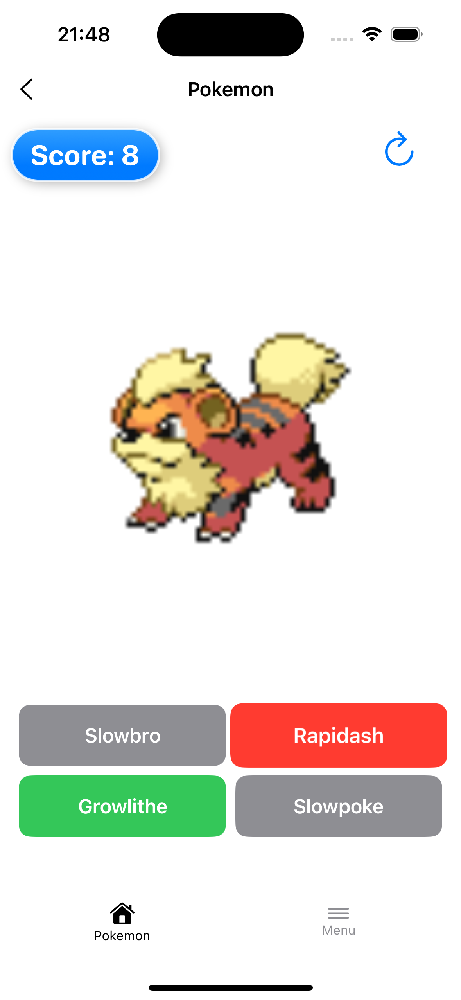
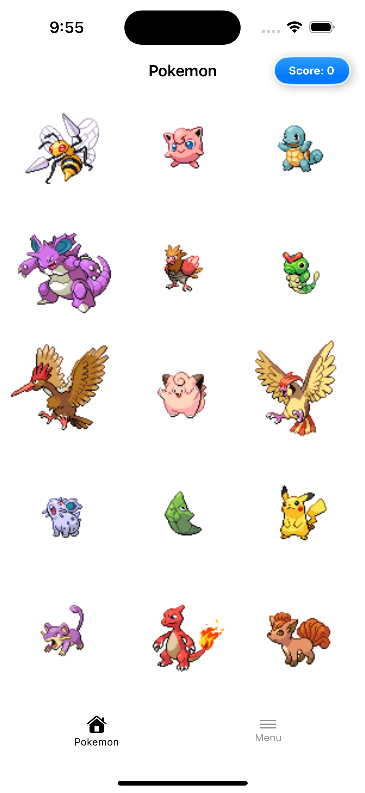

# Pokemon
## Requirements
- Xcode 15+ (for SwiftData support)
- iOS 16.0+
- Swift 5.9

## Getting Started

1. Clone the repository:
2. git clone https://github.com/nithingeorge3/Pokemon.git
3. Open the project:
4. Open Pokemon.xcodeproj in Xcode 15+.
5. Build & Run:
6. Select a simulator or device (iOS 16+) and press Cmd+R.

## Architecture Overview
- SwiftUI-based application designed using the MVVM-C (Model-View-ViewModel-Coordinator) architecture for scalability, modularity, and testability. 
- Implements Repository Pattern for abstracting data sources (API + SwiftData) and Factory Pattern for dependency injection.
- Uses SwiftData for local persistence and async/await for concurrency.


## Key Dependencies
- SwiftData: Local persistence for user preferences and collected Pokémon.
- Native Networking: Uses URLSession and async/await for API calls.

## Approches
1. MVVM-C Architecture: Implemented MVVM-C using async/await.
2. Modular Design:
- PokemonNetworking: API interactions with pagination support.
- PokemonDataStore: SwiftData-powered local persistence.
- PokemonDomain: Business logic layer to prevent circular dependencies.
3. Pokemon List Pagination: Data is fetched from the API with pagination, which is integrated into the scrolling list for seamless user experience.
4. Model Layers: 
- DTO: API response models (decodable).
- SD Model: SwiftData entities for storage.
- Domain Model: Business logic objects.
- View Model: UI-specific data formatting.
5. Coordinator Pattern: Decoupled navigation logic.


## Screenshots 
### iPhone Screens
|||||||||||
### iPad Screens
||||||||

## Scoring Logic Example

**Scenario**: Player answers after 40 seconds (max allowed time: 30s)

```swift
// Time ratio calculation
let elapsed = 40.0
let normalized = min(max(40 / 30, 0), 1) // → 1.0
let ratio = 1 - normalized // → 0.0

// Score calculation
rawScore = 10 * 0.0 → 0.0
roundedScore = 0.0 → 0
evenScore = 0 (already even)
finalScore = max(2, min(10, 0)) → 2

```

## Modules
1. PokemonNetworking: Provides a simple, reusable API wrapper around the network back end, facilitating data retrieval. It abstracts the complexity of networking and parsing, offering a clean interface for developers to interact with API endpoints.
2. PokemonDataStore: Provides a simple, reusable wrapper for data persistence, enabling efficient data saving and retrieval. It abstracts the complexities of data storage, offering a clean interface for developers to interact with data generated by the PokemonNetworking module.
3. PokemonDomain: Provides bridge between PokemonNetworking and PokemonDataStore. It avoiding teh circular dependency.

## Contribution Guidelines  
We ne to follow a streamlined Git workflow to maintain code quality:  

### Branching Strategy  
- `master`: **Release-ready code only** (protected branch).  
- `develop`: Integration branch for features/fixes.  
- Feature Work: Create branches prefixed with `feature/` (e.g., `feature/pokemon-game-view`).  
- Fixes/Docs: Use `fix/` or `docs/` prefixes (e.g., `fix/score-calculation`).  

### Pull Requests (PRs)  
1. Target `develop` for all PRs.  
2. **Rebase & Squash**: Clean up commits before merging to maintain linear history.  
3. Review: At least three approval required.
